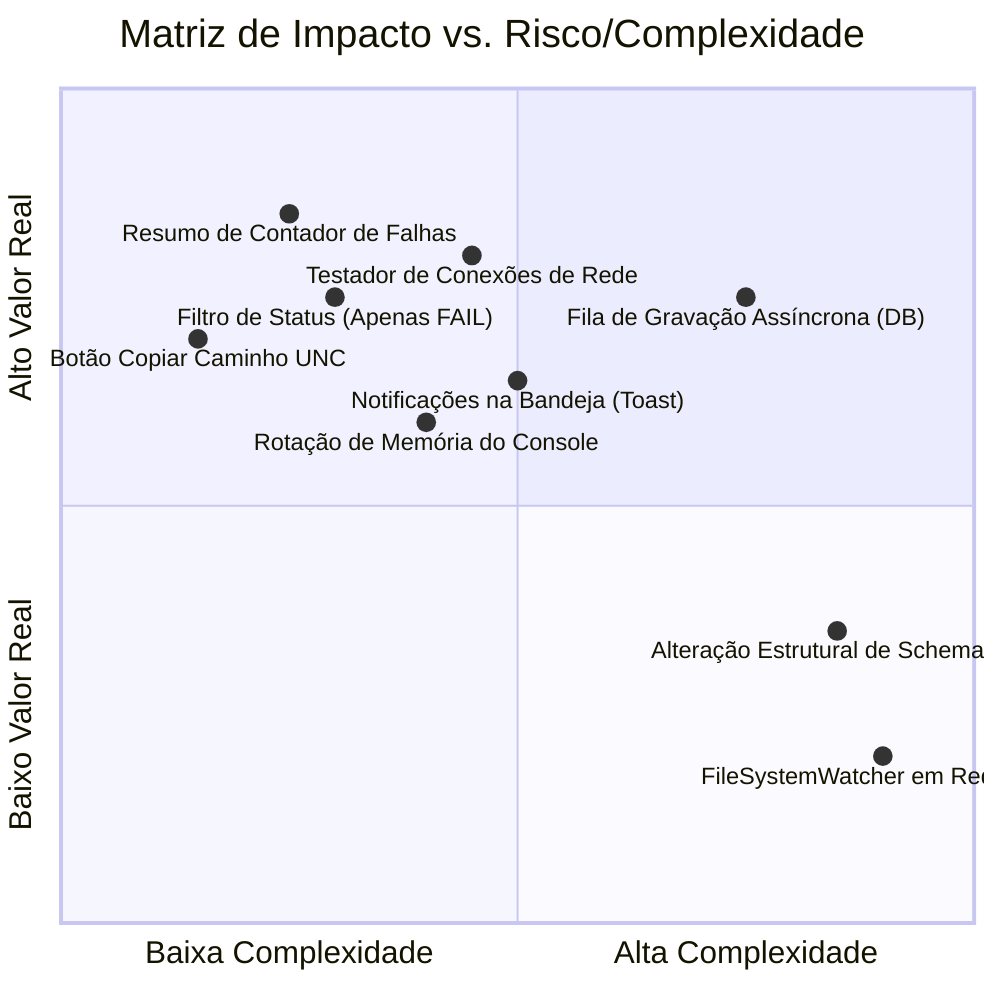

# Análise de Código e Matriz de Melhorias: ICT Master Suite

Este documento apresenta uma revisão completa da arquitetura atual do **ICT Master Suite**, avaliando o estado atual do sistema e classificando as sugestões de melhoria por **tempo de implementação**, **nível de risco** e **valor real entregue para a operação**.

---

## 🔎 1. Avaliação da Arquitetura Atual

Após a recente refatoração e limpeza profunda, o projeto atingiu um nível elevado de maturidade e eficiência:

* **Desempenho de Rede:** A busca recursiva com `os.scandir` limitada a 2 níveis de profundidade (`depth=2`) previne congelamentos e consumo excessivo de banda em servidores de arquivo corporativos (SMB).
* **Leitura Direta sem Bloat:** A remoção de cópias locais e caches temporários evita o acúmulo de arquivos desnecessários no disco do cliente.
* **Resiliência e Monitoramento:** O monitoramento periódico da porta 445 (SMB) em thread separada com timeout de 1.5s garante que o usuário seja alertado instantaneamente em caso de oscilação da rede corporativa.
* **Visualização Limpa:** A aplicação de realce visual em HTML diretamente no visualizador de logs facilita a rápida identificação de falhas sem a complexidade de parsers de tabela instáveis.

---

## 📊 2. Matriz de Melhorias Sugeridas

Abaixo, as sugestões de melhorias estão categorizadas de acordo com o esforço necessário, o risco de introduzir regressões e o ganho real para os técnicos e para a equipe de TI/Engenharia.

---

## 🟢 Categoria 1: Rápida Implementação & Baixo Risco (Quick Wins / Alto Impacto Real)

Estas melhorias levam poucos minutos para serem codificadas, têm **risco zero de quebrar o sistema** e trazem utilidade imediata aos técnicos.

### 1.1. Resumo / Contador de Falhas Encontradas no Cabeçalho do Log
* **O que faz:** No cabeçalho de informação do log (`lbl_info`), exibir um indicador de quantidade (ex: `🔴 3 Ocorrências de Falha Detectadas no Arquivo`).
* **Valor Real:** O técnico não precisa rolar o log inteiro para saber se o arquivo contém poucas ou muitas falhas.
* **Tempo Estimado:** ~15 minutos.
* **Nível de Risco:** 🟢 Baixíssimo.

### 1.2. Botão "📋 Copiar Caminho do Arquivo"
* **O que faz:** Adicionar um botão discreto ao lado de `lbl_info` para copiar o caminho de rede do log selecionado (`\\147.1.0.95\...`) direto para a área de transferência do Windows.
* **Valor Real:** Facilita ao técnico abrir o arquivo no Notepad++, anexar em um e-mail ou enviar para a engenharia via Teams.
* **Tempo Estimado:** ~10 minutos.
* **Nível de Risco:** 🟢 Baixíssimo.

### 1.3. Filtro por Status na Lista de Resultados (Ex: *Todos os Logs* vs. *Apenas Arquivos FAIL*)
* **O que faz:** Adicionar uma caixa de seleção rápida para ocultar logs de teste informativos ou de sistema da lista de busca.
* **Valor Real:** Reduz a poluição visual na busca de seriais que geram múltiplos logs de sistema.
* **Tempo Estimado:** ~20 minutos.
* **Nível de Risco:** 🟢 Baixíssimo.

---

## 🟡 Categoria 2: Média Implementação & Baixo/Médio Risco (Estabilidade e Diagnóstico)

Melhorias com complexidade moderada que aumentam a robustez do software em uso contínuo de fábrica.

### 2.1. Testador Inteligente de Caminhos ("🔍 Testar Conexões")
* **O que faz:** Na aba **Configurações do Sistema**, adicionar um botão de teste que valida individualmente se cada um dos 5 caminhos de rede inseridos está acessível no momento, exibindo indicadores `🟢 Acessível` ou `🔴 Inacessível`.
* **Valor Real:** Permite ao técnico de TI/Engenharia diagnosticar na hora se uma falha de busca é devido a permissão de pasta ou digitação incorreta de IP.
* **Tempo Estimado:** ~35 minutos.
* **Nível de Risco:** 🟡 Baixo.

### 2.2. Rotação / Limite do Log de Memória do Console (`txt_console_output`)
* **O que faz:** Truncar o texto do mini console para manter no máximo 1.000 linhas de histórico ativo na RAM.
* **Valor Real:** Previne aumento excessivo do consumo de memória RAM se o programa ficar aberto sem reiniciar por semanas na fábrica.
* **Tempo Estimado:** ~15 minutos.
* **Nível de Risco:** 🟡 Baixo.

### 2.3. Notificações Nativas do Windows na Bandeja (Toast Notifications)
* **O que faz:** Exibir uma notificação flutuante discreta do Windows quando o monitor de rede detectar queda da conexão ou quando a cópia do TRI falhar por falta de permissão de gravação.
* **Valor Real:** Alerta o técnico mesmo se a janela do sistema estiver minimizada no canto do relógio.
* **Tempo Estimado:** ~25 minutos.
* **Nível de Risco:** 🟡 Baixo.

---

## 🔵 Categoria 3: Mais Demoradas / Estruturais & Baixo/Médio Risco (Arquitetura)

### 3.1. Fila de Gravação Assíncrona para o Banco de Dados (SQLite Worker Queue)
* **O que faz:** Mover a chamada `salvar_falha_db()` (que registra a falha no banco central) para uma thread de fila em segundo plano.
* **Valor Real:** Garante que, se o banco SQLite de rede sofrer trava momentânea (*database locked*) por acessos concorrentes de várias máquinas, a interface visual do aplicativo continue 100% fluida para o operador.
* **Tempo Estimado:** ~1 hora.
* **Nível de Risco:** 🟡 Baixo a Médio.

---

## 🔴 Categoria 4: Alto Risco ou Baixo Valor Real (O que DEVE SER EVITADO)

Recursos que **não recomendamos implementar** no momento devido ao risco de instabilidade na fábrica ou baixo retorno prático.

### 4.1. Trocar Polling (`scandir`) por Observador Nativo de Sistema de Arquivos (`FileSystemWatcher` / `Watchdog`)
* **Por que evitar:** Em compartilhamentos de rede Windows/Linux via protocolo SMB (`\\147.1.0.95\...`), eventos nativos de alteração de arquivo frequentemente perdem pacotes ou falham silenciosamente.
* **Risco:** 🔴 Alto. O polling periódico atual de 30s é infinitamente mais confiável e imune a oscilações de pacotes SMB.

### 4.2. Módulos Complexos de Autenticação / RBAC / Métricas Gráficas Internas
* **Por que evitar:** Foram removidos recentemente a pedido da operação para garantir velocidade máxima. Reinserir telas de login ou dashboards analíticos pesados causaria o desacoplamento do objetivo principal da ferramenta (busca ultrarrápida e cópia limpa).
* **Risco:** 🔴 Alto (Poluição de código e perda de foco).

---

## 📋 Resumo Recomendado para Próxima Etapa

Se desejar implementar melhorias adicionais, a recomendação mais eficiente e de maior valor prático é aplicar o conjunto da **Categoria 1** (Contador de Falhas + Botão de Copiar Caminho + Filtro por Status) e o **Testador de Conexões** da Categoria 2.
